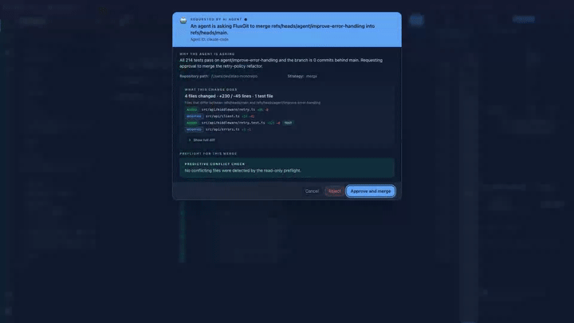

# fluxgit-mcp-sidecar
<!-- mcp-name: io.github.fluxgit-hq/fluxgit-mcp-server -->

`mcp-name: io.github.fluxgit-hq/fluxgit-mcp-server`

[](LICENSE)
[](https://glama.ai/mcp/servers/fluxgit-hq/fluxgit-mcp-server)
[](https://modelcontextprotocol.io)

**Safety-first Model Context Protocol (MCP) server for Git.**

> AI agents inspect. FluxGit keeps control.

A Rust MCP server with **38 contracts** for AI code agents: **25 read-only
tools** and **13 human-gated operation tools** (12 proposals plus cancellation
of a pending proposal). The sidecar never executes a Git write; it bridges
approved proposals to the [FluxGit](https://fluxgit.com) desktop application.



For context-budget comparisons, see the public [Git context token benchmark](https://fluxgit.com/research/git-context-token-benchmark/). It publishes the fixture, raw outputs, scripts and checksums, including both the broad CLI sweep and a smaller hand-tuned counterexample.

---

## Why this exists

AI coding agents are increasingly asked to navigate real repositories: explain branch state, summarize diffs, find lost commits, recommend safe next steps. To do this well, an agent needs Git context that is richer than `git status` and structured enough to reason over. To do this safely, an agent must never be able to silently mutate refs, force-push, discard work, or apply patches without a human approving the consequence.

Other MCP Git servers face a choice: stay strictly read-only (limited utility)
or expose write tools directly (dangerous — agents hallucinate, prompts can be
poisoned, mistakes are destructive). This sidecar chooses neither. Inspection
is schema-validated and bounded; operations go through a
**write-with-UI-handshake**: the agent proposes, FluxGit shows the preview, the
user approves in the app, and FluxGit executes through its safety pipeline with
restore points and audit.

---

## What's exposed

### 25 read-only tools

| Tool | Purpose |
|---|---|
| `repo.brief` | **One-call situational awareness** — branch, ahead/behind, in-progress operation, working-tree summary, stashes, aggregated submodule drift, recent commits, detected conventions and next-step hints. The recommended first call of an agent session; replaces 6-10 raw git calls and is token-budgeted by design |
| `repo.scope` | **Monorepo scoping** — one subtree's working-tree changes, recent commits, churn (commits + authors over a window) and CODEOWNERS owners in a single call |
| `repo.status` | Working tree, current branch, dirty paths |
| `repo.refs` | Branches, tags, remotes, stashes |
| `repo.branchStack` | Current branch vs upstream / base / related |
| `repo.history` | Paginated commit history |
| `repo.reflog` | Movement timeline with recovery hints |
| `repo.conflictPreflight` | Predict merge/rebase outcome before running |
| `conflict.read` | **Active conflict as structured data** — in-progress operation, ours/theirs producing commits, per-file stage classification, base/ours/theirs contents (size-capped, binary-flagged) and marker region line ranges. No more parsing `<<<<<<<` soup |
| `commit.details` | Single commit metadata + changed files |
| `worktree.changes` | Per-path working tree change summary |
| `worktree.list` | All worktrees (main + linked) with branch/detached, HEAD SHA and locked/prunable flags — the read-only base for parallel agent worktrees |
| `submodule.status` | Submodule list and state |
| `diff.text` | Standard text patch (`git diff` compatible) |
| `diff.semantic` | Capability-negotiated semantic explanation |
| `diff.semanticFallbacks` | Paths that fell back from semantic to text |
| `fleet.radar` | Multi-repo attention queue |
| `fleet.digest` | **What changed across the fleet since a time** — HEAD and local-branch reflog moves of many repositories, newest first, bounded by `maxEvents` (default 200, max 1000). `repoPaths`, or FluxGit's registered repositories inside the allowed roots when omitted. `identity` is exactly what Git recorded (the configured identity, not proof of a person or an agent); `rewrote` flags moves that dropped the previous tip (reset, amend, rebase, forced moves). Reads reflog files only; nothing is fetched or written |
| `agents.presence` | **Which other coding agents are working in this repository** — from local sources only (running agent processes and their children, the agents' own session stores, files they keep in the repository, editors with built-in agents, and FluxGit MCP presence records). Per agent: `state` (working/open/recent), `sources`, branch, last tool and repository-relative files when known. Names are what each tool or MCP client declares about itself. Your own MCP record is excluded; findings that are probably your own session are marked `likelyCaller`. Never returns prompts, messages or file contents |
| `safety.timeline` | Synthesized safety events from restore points + reflog |
| `safety.eventDetails` | Drill-down into one timeline event |
| `flux.latestRestorePoint` | Newest FluxGit restore point |
| `flux.restorePoints` | List of restore points |
| `flux.restorePointDetails` | One restore point with before/after refs |
| `operation.status` | Authoritative asynchronous status by `previewId`; poll after a preview returns `accepted: true` and do not report a Git outcome before it becomes terminal |

### 13 write-with-UI-handshake tools

All 12 `operation.preview.*` proposals dispatch through the FluxGit gateway when
configured. The sidecar POSTs the proposal, performs one bounded status read,
and normally returns immediately with `accepted: true`, the canonical
`previewId`, current status and `nextAction.tool: "operation.status"`. The
FluxGit app renders a “Requested by AI agent” approval card while human review
continues asynchronously. Code `10003` is reserved for a bridge that is absent,
invalid or unreachable; it is not a human-approval timeout.

All 12 preview schemas accept an optional bounded `idempotencyKey`. Reuse it
only when retrying the same logical intent; the sidecar scopes it to the
operation type so that retry resolves to the existing gateway proposal. Omit
it for a new intent—even when the other arguments match—and the sidecar sends
a fresh UUID-backed key. Preview tools therefore continue to advertise
`idempotentHint: false`.

| Tool | Purpose | Gateway dispatch |
|---|---|---|
| `operation.preview.merge` | Propose a merge for human review | POST `/v1/mcp/operation/preview/merge` → approval card in FluxGit |
| `operation.preview.rebase` | Propose a non-interactive rebase | `interactive: true` fails schema validation before POST/card creation; accepted requests POST `/v1/mcp/operation/preview/rebase` and open a rewrites-history warning card |
| `operation.preview.discard` | Propose discarding working-tree changes | POST `/v1/mcp/operation/preview/discard` → path-specific warning; FluxGit requires a safety stash before it discards matching changes |
| `operation.preview.reset` | Propose soft / mixed / hard reset | POST `/v1/mcp/operation/preview/reset` → mode-aware card (hard mode forces strong confirmation) |
| `operation.preview.patch` | Propose applying an agent-generated patch | POST `/v1/mcp/operation/preview/patch` → monospace patch preview + applyToIndex toggle |
| `operation.preview.plan` | Propose a 1-10 step sequence using the five supported plan-step types (`merge`, `rebase`, `discard`, `reset`, `patch`) | POST `/v1/mcp/operation/preview/plan` → numbered step card; destructive steps require an explicit checkbox. A `rebase` step with `interactive: true` is rejected by schema validation before dispatch; execution stops at the first failure. Its pre-plan checkpoint anchors only the branch commit: guarded recovery restores HEAD/tracked files, while the original index, working tree and untracked files require the separate step snapshots/Safety Timeline recovery surfaces |
| `operation.preview.worktree` | Propose creating an isolated worktree for a parallel task (non-destructive; never touches history) | POST `/v1/mcp/operation/preview/worktree` → approval card with branch + target path + reason; runs through the same worktree-create action a manual click uses |
| `operation.preview.commit` | Propose staging + committing with a message (non-destructive; amend not supported) | POST `/v1/mcp/operation/preview/commit` → approval card lists the exact files that will be staged and committed; runs through the normal commit pipeline (hooks, signing, policy); completion returns the new SHA |
| `operation.preview.push` | Propose pushing a branch to a remote (optional set-upstream; force-with-lease shows a HIGH-risk warning) | POST `/v1/mcp/operation/preview/push` → approval card with remote + branch + force warning when applicable; runs the guarded push flow |
| `operation.preview.branch` | Propose creating (and optionally checking out) a branch from a start point | POST `/v1/mcp/operation/preview/branch` → approval card with name + start point + checkout choice |
| `operation.preview.branchDelete` | Propose deleting merged local branches in one or more repositories (`targets`, up to 20 repositories × 20 branches, 100 in total). The agent names branches; FluxGit decides which are deletable. Remote branches are never touched | POST `/v1/mcp/operation/preview/branchDelete` → the card inspects every branch natively and keeps any branch with commits not in HEAD or its upstream, checked out anywhere, or whose tip moved; each deleted tip is journaled in the Fleet branch-deletion history, where Restore recreates it. Completion returns per-branch `deleted`/`failed`/`skipped` results |
| `operation.preview.submodulePointer` | Propose recording (`record`, requires `message`) or returning to (`return`) one submodule pointer at any depth (`parentPath` + `relativePath`). Optional `expectedRecordedOid` / `expectedCheckedOutOid` pins, as read from `submodule.status` | POST `/v1/mcp/operation/preview/submodulePointer` → `record` commits only the gitlink in the parent through Git's own commit (hooks and signing apply; nothing is pushed); `return` checks out the recorded commit detached, journaling the previous checkout as a restore point. The submodule must be initialized, clean and differ from its recorded pointer |
| `operation.cancel` | Cancel the agent's own still-pending proposal by previewId | POST cancel; the card disappears from the user's queue like an expired proposal |

All write proposals require a free-text `reason` so the user sees the agent's justification in the approval modal. All reuse the same durable gateway lifecycle (`pending → approved → executing → completed|failed`, with rejection/cancellation/expiry branches) and the same Tauri bridge in the UI. Six shims cover pending, recoverable, approve, claim, reject and complete. After restart, Approved proposals may resume only after repo/ref revalidation and claim; Executing proposals are shown for explicit reconciliation and are never blindly re-executed. When an approved operation captures a restore point, the completion `result` exposes that recovery metadata so the agent can report it without guessing.

The boundary is deliberately fail-closed at approval time. FluxGit resolves the
proposal's `repoPath` to its canonical open-repository id and requires it to
match the repository the human is reviewing; an unresolved path, mismatch, or
repository switch blocks execution. Tool arguments are validated before
dispatch and again by the gateway. An optional declarative agent policy can
deny proposals before a card opens. Its rules match the `agentId` the sidecar
forwards (the sanitized, self-declared `clientInfo.name`, such as `claude-code`)
and can limit that agent to operations, refs and, with `pathConstraints`,
repository and worktree path prefixes. If `FLUXGIT_MCP_AGENT_POLICY` is configured
but the file is missing, unreadable, malformed, or unsupported, the gateway
does not start. With no configured policy, compatibility remains permissive,
but per-operation human approval is still mandatory.

### Other agents in the same repository (collision hints)

Every `operation.preview.*` result may carry an optional `otherAgents` object:
the other agents `agents.presence` finds in the proposal's repository and, when
both sides name their files (discard and commit `paths`, patch headers, plan
steps, the submodule directory of `submodulePointer`), the `overlappingPaths`. It is informational only: it is added after
the gateway decided, never blocks a proposal and never changes how it is
approved. It is absent when agent detection is disabled.

```json
"otherAgents": {
  "informational": true,
  "agents": [{ "agent": "codex", "state": "working", "sources": ["process", "session"],
               "branch": "codex/fix-login", "lastTool": "apply_patch",
               "files": ["src/login.rs"], "overlappingPaths": ["src/login.rs"],
               "pid": 4242, "lastActivityMs": 1790000000000, "mcpClient": null,
               "sameAgentAsCaller": false }],
  "agentCount": 1, "overlappingAgentCount": 1, "proposalPathsKnown": true,
  "omittedLikelyCaller": 1, "note": "Informational only: ..."
}
```

Detection is local and read-only: other agents' SQLite stores are opened
read-only and only repository-relative paths, tool names, branches and times
leave the detector. `FLUXGIT_MCP_AGENT_DETECTION_DISABLED` (any value) turns it
off: `agents.presence` then returns `10011` and previews carry no hint.

Each sidecar also records which repositories its client used, so the desktop
and other sidecars can see it: `<run_dir>/presence/mcp/<pid>.json` (0600) with
the self-declared `clientInfo` name and version and, per repository, the
canonical path, time and last tool name. Only calls that were accepted are
recorded (a proposal the agent policy or a missing FluxGit refused is not);
the file is removed on clean exit. `FLUXGIT_MCP_PRESENCE_DISABLED` turns it
off.

### Write protocol details

Every `operation.preview.*` call follows the same wire protocol. Example for `operation.preview.merge`:

**1. Sidecar POSTs the proposal:**

```http
POST /v1/mcp/operation/preview/merge HTTP/1.1
Host: 127.0.0.1:59647
Content-Type: application/json

{
  "previewId": "1f3c5b9a-...-uuid",
  "agentId": "external-mcp-sidecar",
  "operationType": "merge",
  "repoPath": "/Users/dev/projects/checkout",
  "sourceRef": "feature/cart-redesign",
  "targetRef": "main",
  "reason": "Cart redesign work is complete; tests pass on the feature branch.",
  "strategy": "merge",
  "requestedAt": "2026-05-28T11:42:09.512Z"
}
```

**2. Gateway responds 202 Accepted:**

```json
{ "previewId": "1f3c5b9a-...-uuid", "status": "pending", "expiresAt": "2026-05-28T11:47:09.512Z" }
```

**3. Sidecar performs one bounded status read:**

```http
GET /v1/mcp/operation/status/1f3c5b9a-...-uuid HTTP/1.1
Host: 127.0.0.1:59647
```

If the proposal is still live, the preview tool returns promptly:

```json
{
  "tool": "operation.preview.merge",
  "readOnly": false,
  "accepted": true,
  "previewId": "1f3c5b9a-...-uuid",
  "status": "pending",
  "nextAction": {
    "tool": "operation.status",
    "data": { "previewId": "1f3c5b9a-...-uuid" }
  }
}
```

This is a successful proposal submission, **not** a successful Git operation.

**4. Client polls `operation.status` until the gateway reports a terminal state:**

```json
{
  "previewId": "1f3c5b9a-...-uuid",
  "operationType": "merge",
  "status": "completed",
  "result": {
    "commitSha": "9a8b7c6d...",
    "restorePointId": "rp_2026_05_28_1142",
    "conflicts": []
  }
}
```

`completed` returns `isError: false`. A live `pending` or `approved` proposal
also returns as a successful accepted result, but it does not claim Git changed.
Any non-completed terminal state (`rejected`, `failed`, `expired`, `cancelled`)
returns `isError: true` with the structured payload, so the agent can report the
real outcome instead of inventing one.

The same pattern applies to all 12 `operation.preview.*` tools. Only the request
body fields and result shape differ; proposal submission, the one immediate
read, asynchronous `operation.status` continuation and error semantics are
shared. The public contract summary is maintained at
[fluxgit.com/features/mcp-agent-git](https://fluxgit.com/features/mcp-agent-git/).

---

## Boundary: free shell vs FluxGit-powered

The sidecar speaks MCP without FluxGit installed. Standard Git inspection works (status, refs, history, reflog, diff.text, etc). The tools that require FluxGit return JSON-RPC error code `10001` with an `upgradeHint` pointing the agent at the install/configure flow.

Tier classification:

- **Free shell** — work with local `git` only: `repo.brief`, `repo.scope`, `repo.status`, `repo.refs`, `repo.branchStack`, `repo.history`, `repo.reflog`, `commit.details`, `worktree.changes`, `worktree.list`, `submodule.status`, `diff.text`, `conflict.read`, `fleet.digest`. `agents.presence` also needs no FluxGit: it reads local agent state (and FluxGit's MCP presence records when present).
- **Hybrid** — work locally with documented fallback, enriched by FluxGit: `fleet.radar`, `diff.semantic`, `diff.semanticFallbacks`, `repo.conflictPreflight`.
- **FluxGit-required** — return `gateway_not_configured` without FluxGit because synthesizing them from local refs alone would mislead the agent: `safety.timeline`, `safety.eventDetails`, `flux.latestRestorePoint`, `flux.restorePoints`, `flux.restorePointDetails`.
- **Write handshake** — route through FluxGit UI approval via the gateway
  handshake server. The 12 `operation.preview.*` tools return an accepted live
  proposal promptly and continue through `operation.status`; `operation.cancel`
  withdraws a pending proposal owned by the same agent. Code `10003` is used
  only when the bridge cannot accept or serve the handshake.

---

## Quick start

Install the published crate (puts `fluxgit-mcp-sidecar` on your `PATH`):

```bash
cargo install fluxgit-mcp-sidecar --locked
```

To install the current source branch instead:

```bash
cargo install --git https://github.com/fluxgit-hq/fluxgit-mcp-server fluxgit-mcp-sidecar --locked
```

Or build from a clone:

```bash
# Build
cargo build --release

# Run as MCP server (stdin/stdout transport)
./target/release/fluxgit-mcp-sidecar
```

### Connect any MCP-compatible agent

Paste the generic block below into any MCP host config. No client-specific install required.

```json
{
  "mcpServers": {
    "fluxgit": {
      "type": "stdio",
      "command": "/absolute/path/to/fluxgit-mcp-sidecar",
      "env": {
        "FLUXGIT_MCP_HANDSHAKE_ADDR": "127.0.0.1:59647",
        "FLUXGIT_MCP_AUDIT_LOG": "/optional/path/to/audit.jsonl"
      }
    }
  }
}
```

`FLUXGIT_MCP_HANDSHAKE_ADDR` is the canonical bridge address generated by
FluxGit Quick Connect. `FLUXGIT_GATEWAY_ADDR` and `FLUXGIT_GATEWAY_URL` remain
compatibility fallbacks. The sidecar accepts only plain HTTP on a loopback host
with an explicit port; a remote host, credentials, path, query, fragment, HTTPS,
or missing port is rejected. Without a valid local bridge, the free-shell tier
still works.

`FLUXGIT_MCP_AUDIT_LOG` enables an append-only JSONL audit log of every `tools/call`. Arguments are hashed; raw paths and identifiers are never written verbatim.

---

## Semantic diff contract

`diff.semantic` is the most-used tool for AI agents and the easiest to misuse. The rule is strict:

> A result may only be called *semantic* if `data.supported` is exactly `true`.

When the FluxGit semantic engine is not available (FluxGit app not running, gateway address not configured, or the repository not registered in FluxGit), `diff.semantic` returns:

```json
{
  "tool": "diff.semantic",
  "readOnly": true,
  "data": {
    "supported": false,
    "fallback": "diff.text",
    "reason": "Semantic diff is not available in local sidecar fallback mode.",
    "textDiffArguments": { "repoPath": "...", "base": "...", "head": "...", "path": "..." }
  }
}
```

With the FluxGit app running and the repository registered in FluxGit, the same call is served by the FluxGit diff-engine through the gateway's read-only bridge and returns `supported: true` with per-file semantic hunks:

```json
{
  "tool": "diff.semantic",
  "readOnly": true,
  "source": "fluxgit-gateway",
  "data": {
    "supported": true,
    "engine": "fluxgit-diff-engine",
    "files": [
      {
        "path": "src/main.rs",
        "fallbackToText": false,
        "hunks": [{
          "header": "fn main",
          "lines": [{
            "type": "modified", "oldLine": 3, "newLine": 3,
            "content": "let x = 2;", "oldContent": "let x = 1;",
            "changedTokens": ["2"], "oldChangedTokens": ["1"]
          }]
        }]
      },
      {
        "path": "logo.bin",
        "fallbackToText": true,
        "hunks": [],
        "reason": "The semantic engine could not parse this file (unsupported language, binary or unreadable source); use a text diff for it.",
        "textDiffArguments": { "repoPath": "...", "base": "...", "head": "...", "path": "logo.bin" }
      }
    ],
    "changedFiles": 2,
    "filesTruncated": false
  }
}
```

Honesty is per file, not just per call: files the engine could not parse arrive with `fallbackToText: true`, a reason, and ready-to-use `textDiffArguments` — never as synthesized semantic hunks. `diff.semanticFallbacks` follows the same split and, when connected, lists the engine's real per-file fallback records.

Connected agents must:
1. Call `diff.semantic`.
2. Read `data.supported`.
3. If `true`, use the semantic payload and label results as semantic — except entries with `fallbackToText: true`, which must be presented as text fallbacks.
4. If `false`, call `diff.text` with `data.textDiffArguments` and present results as a text-diff fallback.
5. Never infer function- or class-level moves from a text patch alone.

Allowed wording: *"FluxGit reported a text-diff fallback for this file"*.
Prohibited wording: *"This is a semantic diff"* when `supported=false`.

---

## Presence file (which agent is working where)

Unless `FLUXGIT_MCP_PRESENCE_DISABLED` is set, each sidecar process keeps one
local file, `<FluxGit run dir>/presence/mcp/<pid>.json`, so the FluxGit desktop
app can show which coding agent is connected and which repository it is working
on. It holds only the client name and version the agent declared in
`initialize`, and per repository (at most 16) the checked `repoPath`, the time
of the last call and the tool name. No other arguments, no results. Unlike the
audit log, the repository path is stored as-is so the desktop can match it; the
file is private (`0600` in a `0700` directory), rewritten atomically, deleted on
clean exit, swept after 24 hours, and writing it never affects a tool call.
The client name is self-declared, not an authenticated identity.

---

## Audit log

Unless `FLUXGIT_MCP_AUDIT_DISABLED` is set, the sidecar attempts to append each
`tools/call` to the shared JSONL ledger. The gateway attempts human-decision
appends through the same writer. `FLUXGIT_MCP_AUDIT_LOG` overrides the path;
otherwise both processes use `<FluxGit run dir>/audit/mcp.jsonl` (including
`FLUXGIT_RUN_DIR`):

```json
{
  "id": "bdeca765-488c-4e2a-b86b-25cd734f2988",
  "timestamp": 1712345678901,
  "auditSchemaVersion": 1,
  "auditChainVersion": 1,
  "sequence": 42,
  "segmentId": "7ab6fa7a-c5bf-4d82-86a8-26b4728b5acd",
  "previousHash": "sha256:...",
  "entryHash": "sha256:...",
  "tool": "repo.status",
  "event_type": "tool_call",
  "repo_scope": "repoPath:sha256:...",
  "args_fingerprint": "sha256:...",
  "risk": "read",
  "approval": "none",
  "result": "success",
  "session_id": "my-agent",
  "duration_ms": 12,
  "summary": "...",
  "readOnly": true,
  "sidecarReadOnly": true,
  "signature": "base64url-ed25519",
  "signatureKeyId": "1a2b3c4d5e6f7a8b",
  "signatureVersion": 3
}
```

Sensitive paths and identifiers are hashed, never stored verbatim. One stable
cross-process lock protects validation, rotation and the complete append plus
sync. Lines are limited to 256 KiB. The active segment rotates at 4 MiB and at
most four rotated segments are retained, with a signed checkpoint when signing
is configured.

### Per-entry Ed25519 signatures (shipped 2026-05-28)

Audit signing is opt-in. When `FLUXGIT_MCP_AUDIT_SIGN_KEY` points to a PEM PKCS8 Ed25519 private key, every appended entry is signed with that key. Signed entries add:

- `signature` — base64url (no padding) Ed25519 signature over the **canonical JSON** of the entry without the signature field.
- `signatureKeyId` — 16-char hex prefix of the matching public key, so rotated keys can co-exist in the same JSONL.
- `signatureVersion: 3` — current chained signing domain; the key id, sequence,
  previous hash and entry hash are included in the signed bytes.

**Canonical JSON rule** (verifier must match exactly): recursively sort every
object's keys lexicographically by UTF-8 byte order; arrays preserve order;
strip `signature`; serialize compactly. For versions 2 and 3, keep
`signatureKeyId` and `signatureVersion` in the signed object. For legacy signed
entries with no version, the verifier also strips `signatureKeyId`.

If the env var is unset, new entries are chained but unsigned for backward
compatibility. If it is explicitly set, an empty, missing, unsafe, oversized or
invalid key fails audit startup closed; it never degrades to unsigned output.

### Verifying an audit log

The sidecar binary doubles as a verifier:

```bash
fluxgit-mcp-sidecar verify-audit /path/to/mcp.jsonl --pubkey /path/to/install.pub.pem
```

The CLI streams the active file and retained rotations with bounded memory. It
validates sequence, hashes, segment names, checkpoints and signatures, then
reports only bounded counters (`entries`, `chained`, `legacy`, `signed`,
`unsigned`, `segments` and the retained sequence range). Legacy per-entry
records remain readable and verifiable but are reported as `legacy`, never as
part of the tamper-evident chain. For a strict evidence gate, run:

```bash
fluxgit-mcp-sidecar verify-audit /path/to/mcp.jsonl --pubkey /path/to/install.pub.pem --require-signed
```

Exit code is `0` on success, `3` for malformed data, broken chain/rotation, a
bad signature and, in strict mode, any unsigned entry; usage errors return `2`.

Programmatic full-ledger verification uses `verify_audit_ledger`; the older
`verify_audit_event_signature` remains available for compatible per-entry
checks. A local chain cannot prove deletion or replacement of the entire
retained history (or its local checkpoint) without an independently trusted
external anchor. Signed retained entries do prevent an attacker without the
private key from recomputing a modified chain.

Audit configuration (including an explicit signing key) fails closed at
startup. A later filesystem/full-disk append failure is logged as degraded but
does not undo a tool response or an already-durable gateway lifecycle
transition; the gateway lifecycle journal remains authoritative for recovery.

---

## Protocol details

The server supports two protocol eras:

- **`2026-07-28` (preferred, stateless):** call `server/discover`, then include
  `params._meta.io.modelcontextprotocol/protocolVersion` and
  `params._meta.io.modelcontextprotocol/clientCapabilities` on every request.
  Modern results carry `resultType: "complete"` and server metadata; list
  results add `ttlMs` and `cacheScope`. `tools/list` includes `title`,
  `inputSchema`, `outputSchema` and annotations. `tools/call` includes both
  presentational `content` and the same payload in `structuredContent`.
- **`2024-11-05` (legacy compatibility):** older hosts continue to use
  `initialize`. Modern-only fields are omitted from legacy results.

Stdio output is standard newline-delimited JSON-RPC 2.0: exactly one compact
JSON value per line. Pre-standard `Content-Length` framing remains accepted as
**input only** for old FluxGit clients; the server never emits it. Frames are
limited to 8 MiB. JSON-RPC notifications receive no response, and request
methods sent without an id are not executed.

There are 38 tools in modern `tools/list`: 25 advertise
`annotations.readOnlyHint: true`; the 12 `operation.preview.*` tools and
`operation.cancel` advertise `readOnlyHint: false`. These annotations describe
effects for the host; they are not authorization.

Error codes:

| Code | Meaning |
|---|---|
| `-32700` | Parse error |
| `-32600` | Invalid request (malformed JSON-RPC) |
| `-32601` | Method not found |
| `-32602` | Invalid params or unknown tool |
| `-32603` | Internal error |
| `-32022` | Unsupported modern MCP version; `data` contains `supported` and `requested` |
| `10001` | Gateway not configured — install/start FluxGit to use FluxGit-required tools |
| `10002` | A configured FluxGit bridge had no payload to serve (for example, a local fallback lacked an absolute `repoPath`) |
| `10003` | The local write-handshake bridge is absent, invalid or unreachable; no accepted proposal should be inferred |
| `10004` | Proposal ended without completion (`rejected`, `failed`, `expired` or `cancelled`) |
| `10005` | The gateway does not know the requested `previewId` (wrong/never-accepted id or pruning after terminal retention). Restart alone does not justify a new proposal: Approved/Executing records recover durably and a possibly-started Git outcome must be reconciled first. |
| `10006` | Gateway refused the proposal before opening a card (policy, validation or quota) |
| `10007` | Gateway returned a malformed/unsafe canonical `previewId`; the sidecar refuses to follow it |
| `10010` | Local read-only Git command failed |
| `10011` | Agent detection is disabled (`FLUXGIT_MCP_AGENT_DETECTION_DISABLED`); `agents.presence` cannot answer |

---

## Status

This is a working MCP server. The read-only surface and all 12
`operation.preview.*` routes are implemented; `operation.cancel` manages only a
pending proposal owned by the same self-reported agent id. The write handshake
renders an approval card in FluxGit and completes through the app's guarded
pipeline. Clients receive structured lifecycle results instead of a synthetic
success. `clientInfo.name` is sanitized attribution for policy, quota and audit;
it is self-reported and must never be treated as authenticated identity.

## Roadmap

- **End-to-end demo video** — public recording of the agent-proposes → user-approves → FluxGit-executes loop, captured from a live install.
- **Audit log exportable CSV/JSON** — shipped: per-entry Ed25519 signing (2026-05-28). Remaining: exportable CSV/JSON and retention policy for the FluxGit app's audit panel.
- **HTTP / SSE transport** — for cloud / shared MCP host deployments.
- **Official MCP Registry** — [`io.github.fluxgit-hq/fluxgit-mcp-server`](https://registry.modelcontextprotocol.io/v0.1/servers?search=io.github.fluxgit-hq%2Ffluxgit-mcp-server) is live and resolves to the published [`fluxgit-mcp-sidecar`](https://crates.io/crates/fluxgit-mcp-sidecar) crate.

## License

Apache-2.0. See `LICENSE`.

## Related

- [FluxGit](https://fluxgit.com) — the desktop app that produces the FluxGit-powered context.
- [MCP agent Git](https://fluxgit.com/features/mcp-agent-git/) — public product and protocol overview.
- [Claude Code](https://fluxgit.com/for/claude-code), [Cursor](https://fluxgit.com/for/cursor), and [Codex](https://fluxgit.com/for/codex) — setup and workflow guides.
- [Git context token benchmark](https://fluxgit.com/research/git-context-token-benchmark/) — reproducible fixture, raw outputs, scripts and checksums.
- [Public source](https://github.com/fluxgit-hq/fluxgit-mcp-server) — this Apache-2.0 server.
